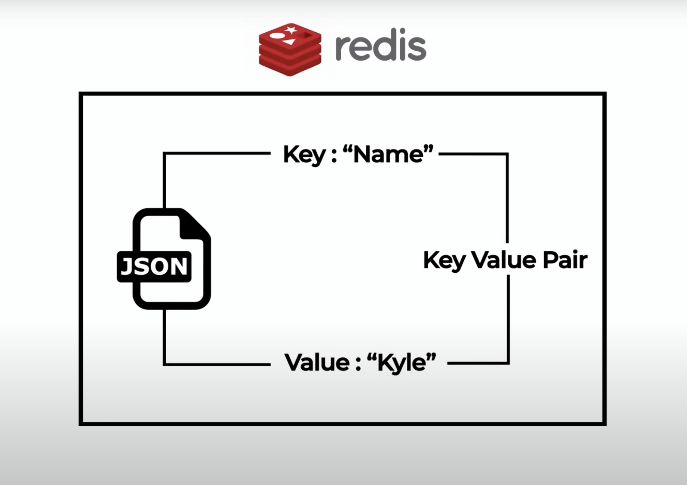

# Redis Cheat Sheet

- [Redis Cheat Sheet](#redis-cheat-sheet)
  - [What is Redis?](#what-is-redis)
  - [How to install Redis](#how-to-install-redis)
  - [Redis CLI](#redis-cli)
  - [Redis in NodeJS](#redis-in-nodejs)
  - [Resources](#resources)

## What is Redis?

Redis **is a type of database** and more specificaly is a NoSQL database. It's not like the other NoSQL databases or like a SQL database (such as MongoDB, PostgreSQL or MySQL) because Redis doesn't have the concept of "document" nor of "table".

All of the data in Redis is stored in **key, value pairs**. Think about Redis as one big giant JSON file.



Unlike the other databases than run on disk, **Redis runs on RAM** (on memory) and this makes it **very fast** but also volatile.

This is why Redis is generally used for caching: it has to be accessed often and it has to be quick.

## How to install Redis

If you're on Mac, install Redis with `brew` as follows:

```
brew install redis
```

## Redis CLI

| Command                         | Description                                                                                                       |
| ------------------------------- | ----------------------------------------------------------------------------------------------------------------- |
| `redis-server`                  | Starts the redis server on your machine                                                                           |
| `redis-cli`                     | Starts the CLI                                                                                                    |
| `quit`                          | If executed in the CLI, it quits the CLI                                                                          |
| `SET name John`                 | Creates an entry `"name": "John"`                                                                                 |
| `GET name`                      | Returns the value of the key `"name"`                                                                             |
| `DEL name`                      | Deletes the entry with key `"name"`                                                                               |
| `EXISTS name`                   | Checks if the entry with key `"name"` exists, returns 1 (true) or 0 (false)                                       |
| `KEYS *`                        | Returns a list of all the keys                                                                                    |
| `FLUSHALL`                      | Deletes everything from the database                                                                              |
| `TTL name`                      | Returns the **time to live*** (in seconds) of the entry with key `"name"`. `-1` means the entry has no expiration |
| `EXPIRE name 10`                | Sets the time to live of the entry with key `"name"` to 10 seconds                                                |
| `SETEX name 10 John`            | Creates an entry `"name": "John"` and sets its **time to live** to 10 seconds                                     |
| `LPUSH friends John`            | Creates an entry `"friends"` that has `"John"` inside of the array                                                |
| `LRANGE friends 0 -1`           | Returns a list of items in the array `"friends"`                                                                  |
| `LPUSH friends Sally`           | Appends the item `"Sally"` on the "right" of the array `"friends"`                                                |
| `LPOP friends`                  | Removes the first item of the array `"friends"` and returns it                                                    |
| `SADD hobbies "playing guitar"` | Creates a **set*** `"hobbies"` and adds the member `"playing guitar"`                                             |

> *Time to live (TTL) is the time that an object is stored in a caching system before it's deleted or refreshed.
> *Sets cannot have duplicate members


## Redis in NodeJS
## Resources
- [https://redis.io/](https://redis.io/)
- [Redis Crash Course on YouTube](https://www.youtube.com/watch?v=jgpVdJB2sKQ&t=17s&ab_channel=WebDevSimplified)